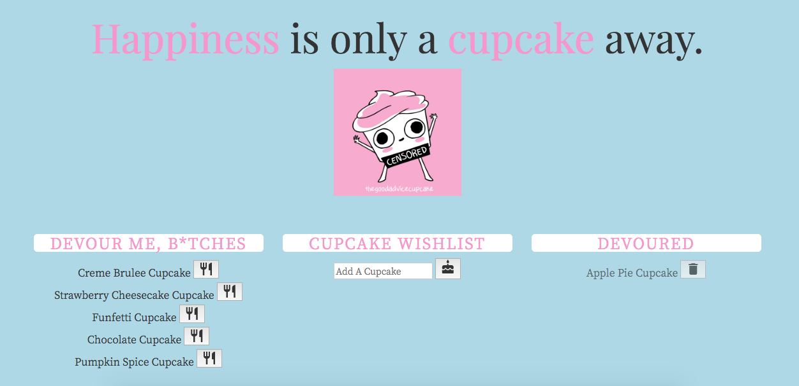

# Cuppy-Cake

Cuppy-Cake is a cupcake logger web application that uses MySQL, Node, Express, Handlebars, and a homemade ORM. It follows the MVC design pattern, uses Node and MySQL to query and route data in the app, and uses Handlebars to generate the HTML.

## Getting Started
[Click here to get eating](https://infinite-taiga-32865.herokuapp.com/)

## Preview

## Technologies used

- mysql NPM Package - https://www.npmjs.com/package/mysql
- express NPM Package - https://www.npmjs.com/package/express
- express handlebars NPM Package - https://www.npmjs.com/package/express-handlebars
- body parser NPM Package - https://www.npmjs.com/package/body-parser

### Prerequisites

- Node.js - Download the latest version of Node https://nodejs.org/en/

## Built With

* Visual Studio Code - Text Editor

## Authors

* **Sandy Yeung** - *HTML/JS/jQuery/Node.js* - [Github](https://github.com/Sandynism)